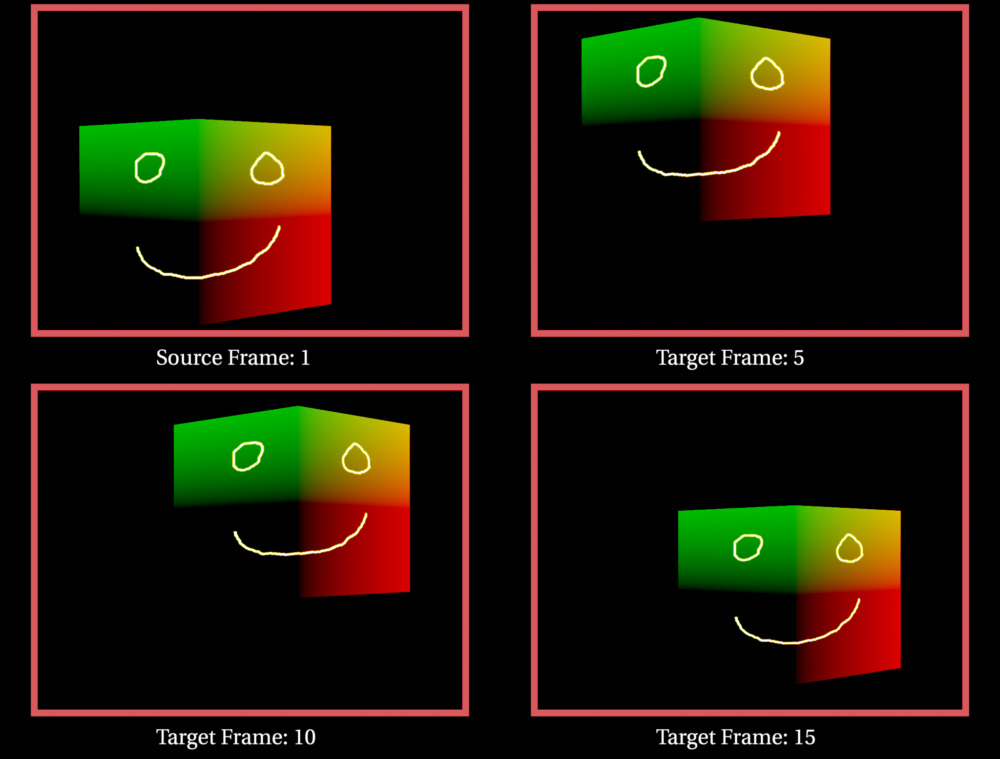

# PRefToMotion
C++ plugin for Foundry's Nuke software that calculates the motion vectors from a source frame to the current frame using a position reference pass or similar. It uses the [nanoflann](https://github.com/jlblancoc/nanoflann) kd-tree library under the hood to do a nearest neighbour lookup using the xyz value of the supplied channel.

|  |
| --- |
| **example image** of a smiley face drawn at frame 1 and warped to 5, 10 and 15 using a position reference pass |


# build

Set the NUKE_VERSION CMake variable to the version of Nuke you wish to compile against, eg. 11.3v6 (tested version), assuming standard installation. Then it's just standard cmake build and make install commands for generation of the Nuke plugin.

- cmake /path/to/PRefToMotion/ -DCMAKE_INSTALL_PREFIX=~/.nuke -DCMAKE_BUILD_TYPE=DEBUG
- make install

# usage
PRefToMotion(.dylib|.so) should now be built and installed into your user's .nuke folder, so now it's just a matter of launching nuke and opening the test script `pref_motion_example.nk`

# parameters
very simple list of parameters to interact with so far, the are:
- **channels**: the channels that hold the xyz pref of similar data, if a 4th channel is supplied it will be used as a mask.
- **source frame**: the source frame to calculate the motion vectors from.
- **samples**: the number of nearest neighbours to look up, used to calculate a weighted average from the squared distance to the lookup point.

# speed
building the indices and querying a kd-tree with more than a million points can tend to be slow, optimisations forth coming.

```buildoutcfg
example timing of building of a kd-tree with 1,063,379

--------------- kd tree ---------------
           bbox: 91, 48, 1469, 1023
output channels: rgba,forward.u,forward.v
  pref channels: rgb
     num points: 1063379
        samples: 3
   source frame: 1
  current frame: 15
--------------- timing ---------------
     query time: 208 ms
     build time: 1096 ms
     total time: 1304 ms
```
